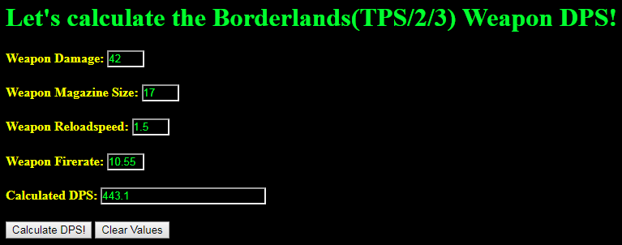

# Borderlands-Weapon-DPS-Calculator-JavaScript-Edition
This now has a template to use the math functions to generate the DPS values of Borderlands (TPS/2/3) weapons.

Here is an example website: (https://leftbased.github.io/Borderlands-Weapon-DPS-Calculator-JavaScript/)

[changelog]

v0.03 
- introduced an html file with form elements that can be manipulated
- adjusted code in the javascript. added css code to html file.

v0.02 
- added an error alert function
- updated safety checks
- fixed an accidental bug in code.

v0.01 
- initial start of project totally works

This was basically ported by hand from my C# code of the original mathmatical formula that was posted on the internet to calculate DPS of borderlands 2 weapons (works for borderlands 3) and it seems accurate because when you sort inventory by score in BL3 it does really give you sort of the best possible DPS weapons, but this is great for calculating the dps from vendor weapons or legendaries you aren't sure which one is better.
